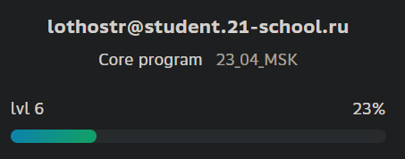
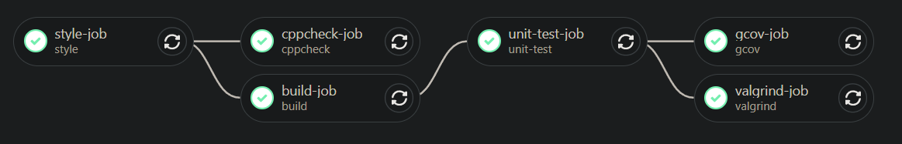

# s21_matrix.a
<!-- slide bg="#1D1F20" -->
**Vladislav**


---
## CI/CD


---
## Makefile
- CC=gcc
- -std=c11
- all
- clean
- test
- NAME=s21_matrix.a
	- $(NAME)
- gcov_report
- Modular makefile

---
## Тесты
- gcov_report
- check

---
## Debugging
- launch.json
- tasks.json

---
## Docker
`src/makefiles/docker.mk`
- Dockerfile
	- .alpine
	- .ubuntu
- CI/CD
	- alpine
- Среда разработки
	- Dockerfile
	- docker-compose.yml
```bash
docker-compose up -d
docker-compose exec ubuntu_dev /bin/zsh
```

---
## Doxygen
- Doxyfile
